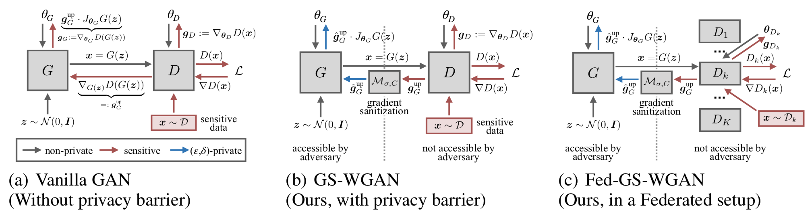

# GS-WGAN
[](https://github.com/yaoyao-liu/mnemonics/blob/master/LICENSE)
[](https://www.python.org/)



This repository contains the implementation for [GS-WGAN: A Gradient-Sanitized Approach for Learning Differentially Private Generators (NeurIPS 2020)](https://arxiv.org/abs/2006.08265).

Contact: Dingfan Chen ([dingfan.chen@cispa.saarland](mailto:dingfan.chen@cispa.saarland))

Please note that the code is currently under construction and subject to changes.

## Requirements 
The environment can be set up using [Anaconda](https://www.anaconda.com/download/) with the following commands:

``` setup
conda create --name gswgan-pytorch python=3.6
conda activate gswgan-pytorch
conda install pytorch=1.2.0 
conda install torchvision -c pytorch
pip install -r requirements.txt
```

## Training 
#### Step 1. To warm-start the discriminators:
```warm-start
cd source
sh pretrain.sh
```
- To run the training in parallel: adjust the 
`'meta_start'` argument and run the script multiple times in parallel.
- Alternatively, you can download the pre-trained models using the links [below](#pre-trained-models). 
   
#### Step 2. To train the differentially private generator:
```train
cd source
python main.py -data 'mnist' -name 'ResNet_default' -ldir '../results/mnist/pretrain/ResNet_default'
```
- Please refer to `source/config.py` (or execute `python main.py -h`) for the complete list of arguments. 

- The default setting require ~22G GPU memory. Please allocate multiple GPUs by specifying the `'-ngpus'` argument if   it does not fit in the memory of one GPU. 

## Evaluation
#### Privacy
- To compute the privacy cost:
    ```privacy 
    cd evaluation
    python privacy_analysis.py -data 'mnist' -name 'ResNet_default'
    ```

## Pre-trained Models
Pre-trained model checkpoints can be downloaded using the links below. The discriminators are obtained after the 
warm-starting step (step 1), while the generators are obtained after the DP training step (step 2). 
The pre-trained models are stored as `.pth` files and the corresponding training configurations are stored in 
`params.pkl` and `params.txt`. 

|   |Generator  | Discriminators |  
|---|---|---|
|MNIST | [link](https://drive.google.com/drive/folders/19KaZouarxgo7qgH76aNTxYj2OTvqS7lL?usp=sharing) | [link](https://drive.google.com/drive/folders/1gg_pq5BkbexJgfuEzGd4fRCTAaLKVWQK?usp=sharing) | 
|Fashion-MNIST | [link](https://drive.google.com/drive/folders/1JzGFeFzyIQ_UuOtv3-XF7BjcrUG2I5jR?usp=sharing) | [link](https://drive.google.com/drive/folders/1XoWjS1cbG4Bihg5abOSvlf3r2MbkqPoL?usp=sharing) | 


## Citation
```bibtex
@inproceedings{neurips20chen,
title = {GS-WGAN: A Gradient-Sanitized Approach for Learning Differentially Private Generators},
author = {Dingfan Chen and Tribhuvanesh Orekondy and Mario Fritz},
year = {2020},
date = {2020-12-06},
booktitle = {Neural Information Processing Systems (NeurIPS)},
pubstate = {published},
tppubtype = {inproceedings}
}
```

## Acknowledgements

Our implementation uses the source code from the following repositories:

* [Improved Training of Wasserstein GANs (Pytorch)](https://github.com/caogang/wgan-gp.git)

* [Improved Training of Wasserstein GANs (Tensorflow)](https://github.com/igul222/improved_wgan_training)

* [GANs with Spectral Normalization and Projection Discriminator](https://github.com/pfnet-research/sngan_projection)

* [Large Scale GAN Training for High Fidelity Natural Image Synthesis](https://github.com/ajbrock/BigGAN-PyTorch.git)

* [Progressive Growing of GANs](https://github.com/tkarras/progressive_growing_of_gans.git)

